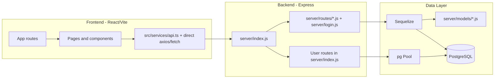
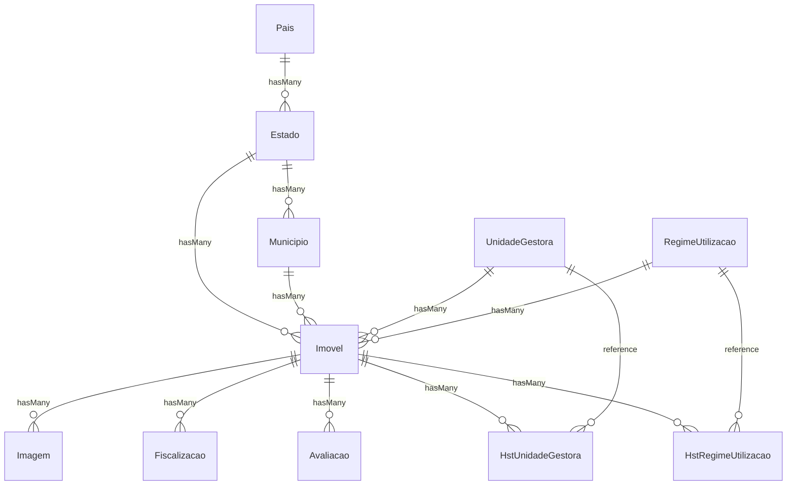
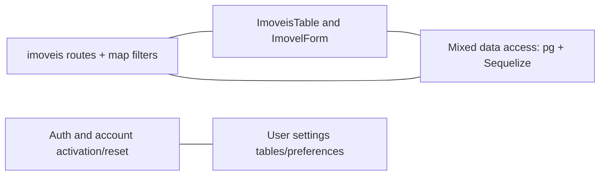

# Code Review Graph

This document provides a review-oriented graph of the project so reviewers can quickly trace impact across UI, API, and data.

## 1) System Graph (Frontend -> Backend -> Data)



## 2) Frontend Route to API Domain Graph

```mermaid
flowchart TD
  R0[/]/ --> LOGIN[LoginPage]
  R1[/reset-senha]/ --> RESET[ResetPasswordPage]
  R2[/ativar-conta]/ --> ACTIVATE[AtivarConta]
  R3[/dashboard]/ --> DASH[Dashboard]
  R4[/imoveis]/ --> IMOVEIS[ImoveisTable]
  R5[/imovel/:id]/ --> IMOVEL_EDIT[ImovelEditPage]
  R6[/mapa]/ --> MAP[MapPage + FilterDrawer]
  R7[/configuracoes]/ --> CFG[Configuracoes]
  R8[/perfil]/ --> PROFILE[PerfilUsuario]
  R9[/cadastros-gerais]/ --> CAD[CadastrosGerais]

  LOGIN --> A1[/api/login, /api/reset-solicitar]
  RESET --> A2[/api/reset-redefinir]
  ACTIVATE --> A3[/api/ativar]
  DASH --> A4[/api/imoveis, /api/municipios, /api/fiscalizacoes, /api/avaliacoes, /api/unidadegestora, /api/regimeutilizacao]
  IMOVEIS --> A5[/api/imoveis, /api/usertablesettings, /api/paises, /api/estados, /api/municipios, /api/unidadegestora, /api/regimeutilizacao, /api/usuarios]
  IMOVEL_EDIT --> A6[/api/imoveis/:id + lookup domains]
  MAP --> A7[/api/imoveis/com-relacoes, /api/poligonosterreno/imovel/:id, /api/lookups/*]
  CFG --> A8[/api/usuarios CRUD + reenviar-ativacao]
  PROFILE --> A9[/api/usuarios/:id]
  CAD --> A10[Location/Regime/UG management endpoints]
```

## 3) Backend Routing Graph

```mermaid
flowchart TB
  IDX[server/index.js]

  IDX --> L0[/api -> server/login.js]
  IDX --> L1[/api/imoveis -> routes/imoveis.js]
  IDX --> L2[/api/municipios -> routes/municipio.js]
  IDX --> L3[/api/estados -> routes/estado.js]
  IDX --> L4[/api/paises -> routes/pais.js]
  IDX --> L5[/api/fiscalizacoes -> routes/fiscalizacao.js]
  IDX --> L6[/api/avaliacoes -> routes/avaliacao.js]
  IDX --> L7[/api/regimeutilizacao -> routes/regimeutilizacao.js]
  IDX --> L8[/api/unidadegestora -> routes/unidadegestora.js]
  IDX --> L9[/api/hstregimeutilizacao -> routes/hstregimeutilizacao.js]
  IDX --> L10[/api/hstunidadegestora -> routes/hstunidadegestora.js]
  IDX --> L11[/api/lookups -> routes/lookups.js]
  IDX --> L12[/api/usertablesettings -> routes/usertablesettings.js]
  IDX --> L13[/api/userpreferences -> routes/userpreferences.js]
  IDX --> L14[/api/poligonosterreno -> routes/poligonosterreno.js]
  IDX --> L15[/api/usuarios + /api/ping + /api/ativar inline in index.js]
```

## 4) Data Model Relationship Graph (Sequelize)



## 5) Review Hotspots Graph (where regressions spread fast)



## 6) Review Path (fast checklist)

1. Start from changed UI page/component.
2. Trace API calls used by that page (axios/fetch target).
3. Open mounted router in server/index.js.
4. Inspect route handlers and payload shape.
5. Verify model/query path (Sequelize model associations or pg SQL).
6. Validate related pages sharing same endpoint domain.
7. Re-test critical hotspots: imoveis, map filters, auth/reset, user settings.
